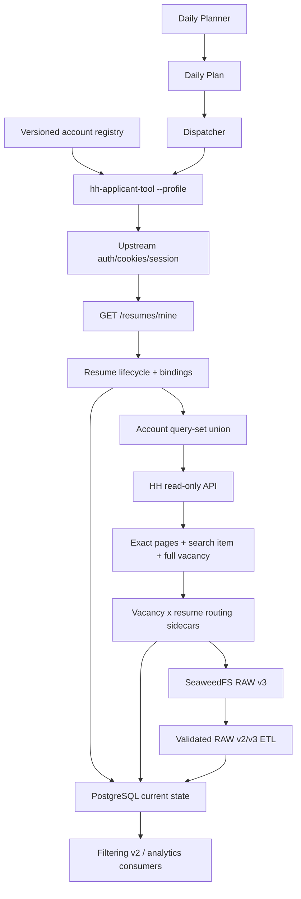

<div align="center">

# 🧠 CareerOPS

### Self-hosted data platform для автоматизации ебливого процесса поиска работы


**По умолчанию только наблюдаю рынок: ищу широко, сохраняю точный RAW и не
отправляю ни одного отклика.**

</div>

---

> [!IMPORTANT]
> **Текущий production default — `OBSERVE`. Автоматические отклики остановлены.**
>
> Scheduler работает по N HH accounts, синхронизирует динамический список
> резюме через `/resumes/mine`, запускает широкие query sets и складывает
> replayable RAW schema v3 в S3.
>
> `APPLY` оставлен как совместимый opt-in путь. Работодатель-facing write
> возможен только при одновременных `--mode apply` и
> `CAREEROPS_HH_ALLOW_EXTERNAL_WRITES=true`; для dynamic resume дополнительно
> нужен активный явный binding с `auto_apply=true`. Deprecated `--live` не
> обходит этот барьер.

> [!NOTE]
> Разделы ниже про старый filtering/application pipeline описывают только
> совместимый `APPLY`, а не текущий `OBSERVE`. Filtering v2 намеренно не входит
> в этот feature.


---

## ✨ Что уже умеет CareerOPS

* 🔐 **Profiles/auth/session принадлежат `hh-applicant-tool`.** CareerOPS выбирает
  существующий `--profile`, но не копирует OAuth, cookies, token state и HH
  transport.

* 👥 **N accounts и N resumes.** Versioned account registry хранит profiles и
  явные bindings; актуальные resume IDs каждый account-run получает через
  все страницы `GET /resumes/mine` существующего upstream transport. Основной
  current state хранится в PostgreSQL; JSON доступен только как явный dev
  fallback.

* ♻️ **Resume lifecycle.** Стабильная identity — HH resume ID. Изменение title
  сохраняет binding, исчезновение делает resume `deleted`, а новый ID остаётся
  unassigned с `auto_apply=false`. Текущий HH publication status хранится
  отдельно: APPLY допускает только `published` resume.

* 🔎 **Broad discovery.** 20 query sets и 388 отдельных RU/EN вариантов для
  ML/AI/DS/DE/Python Backend остаются в каталоге. Каждый account-run атомарно
  резервирует в PostgreSQL очередное детерминированное окно максимум из 50
  query, поэтому каталог ротируется между запусками, а не исполняется целиком.

* 🧾 **Vacancy × resume routing audit.** Для каждой full-fetched vacancy и
  каждого active assigned resume сохраняется отдельный routing record. Sidecar
  несёт account provenance, а OLTP work-item канонически адресуется через
  `run_id + resume_id + vacancy_id`. Query overlap хранится как provenance
  evidence, но ничего не отсекает. Это ещё не Filtering v2.

* 💾 **S3 RAW v3.** Exact search pages, canonical search item, full vacancy,
  provenance и observation sidecars позволяют replay без повторного HH search.

* 🛡️ **Fail-closed writes.** OBSERVE не создаёт cover letters/applications.
  APPLY требует одновременно mode, external-write opt-in, active binding и
  account quota. До POST атомарно фиксируется PostgreSQL claim; resume-specific
  precheck/confirmation не используют глобальный `vacancy.relations` как
  duplicate proof.

* 🪣 **SeaweedFS.** Self-hosted S3-compatible object storage.

* ⏰ **Multi-account Planner + Dispatcher.** Slots глобально разнесены и
  interleaved; CAPTCHA/failure ставит на паузу только затронутый account.

* 🧮 **Per-account APPLY quota.** Начальный cap задаётся в account TOML (example:
  `100/account/day`) и расходуется консервативно по employer-write attempts.

* 🐘 **PostgreSQL OLTP.** Resume lifecycle/bindings, OBSERVE runs, актуальные
  vacancies, vacancy observations, evaluation work items и application claims
  материализуются в существующий operational store.

* 📊 **Данные для будущей аналитики.** S3 RAW и PostgreSQL current state уже
  разделены так, чтобы дальше кормить ClickHouse и нормальный DWH, а не очередной
  Excel с названием `отклики_финал_реально_финал2.xlsx`.

---

## Содержание

* [Что это вообще такое](#-что-это-вообще-такое)
* [Предыстория](#-предыстория)
* [Текущий статус](#-текущий-статус)
* [Архитектура](#️-архитектура)
* [HH и hh-applicant-tool](#️-hh-и-hh-applicant-tool)
* [Поиск вакансий](#-поиск-вакансий)
* [Фильтрация](#-фильтрация)
* [Отправка откликов](#-отправка-откликов)
* [Сопроводительные письма](#️-сопроводительные-письма)
* [Будущий LLM-слой](#-будущий-llm-слой)
* [S3 и данные](#-s3-и-данные)
* [Scheduler](#-scheduler)
* [Структура проекта](#-структура-проекта)
* [Установка](#-установка)
* [Авторизация HH](#-авторизация-hh)
* [Docker worker](#-docker-worker)
* [Установка scheduler](#️-установка-scheduler)
* [Конфигурация](#️-конфигурация)
* [Безопасность](#-безопасность)
* [Ответы на заебавшие вопросы](#-ответы-на-заебавшие-вопросы)
* [Roadmap](#️-roadmap)
* [Благодарность](#️-огромное-спасибо-s3rgeym)

---

# 🧠 Что это вообще такое

**CareerOPS** - self-hosted система, которая превращает поиск работы из бесконечного ручного дрочева в нормальный наблюдаемый pipeline.

Обычный процесс выглядит примерно так:

```text
увидел вакансию
       ↓
прочитал
       ↓
откликнулся
       ↓
забыл
       ↓
через месяц 300 откликов
       ↓
хуй поймёшь, что вообще работает
```

CareerOPS делает иначе:

```text
source
   ↓
discovery
   ↓
RAW
   ↓
prefilter
   ↓
full vacancy
   ↓
validation
   ↓
decision
   ↓
cover letter
   ↓
application
   ↓
confirmation
   ↓
response
   ↓
analytics
```

Каждая вакансия становится данными.

Каждый `SKIP` становится данными.

Каждый отклик становится данными.

Каждый отказ становится данными.

Каждый HR-хуесос, который молчит месяц, тоже в конечном итоге становится строчкой статистики.

И это уже намного полезнее, чем очередная карьерная мудрость из LinkedIn:

> Просто проявляйте искренний интерес к компании 🤗

Спасибо, Боб.

Нахуй.

---

# 📖 Предыстория

Я просто хотел найти работу.

Не строить data platform.

Не поднимать S3.

Не проектировать RAW слой.

Не писать scheduler.

Не думать о будущей ClickHouse аналитике.

Не выяснять, сколько full GET можно сделать подряд до того, как HH попросит CAPTCHA.

Просто найти ебучую работу.

Но современный hiring pipeline очень старательно превращает поиск работы в отдельную full-time работу.

---

## Как сейчас выглядит найм

Примерный процесс:

1. Найти вакансию.
2. Прочитать три экрана текста.
3. Отделить реальные обязанности от "дружной команды" и "возможности влиять на продукт".
4. Загрузить резюме.
5. Снова заполнить руками данные, которые уже есть в резюме.
6. Написать уникальное сопроводительное.
7. Рассказать, почему с детства мечтал работать именно в ООО "Инновационные цифровые решения плюс".
8. Пройти тест.
9. Иногда пройти второй тест.
10. Иногда заполнить Google Form.
11. Иногда опять прикрепить резюме.
12. Иногда пройти какую-нибудь психологическую ебалу.
13. Нажать "Отправить".
14. Получить автоматический отказ через 11 секунд.
15. Повторить это 60 раз.

Охуенно.

Особенно на фоне того, что с другой стороны часто происходит:

```text
CV
 ↓
ATS
 ↓
keywords
 ↓
score
 ↓
REJECT
```

И после этого кандидату рассказывают про важность:

> индивидуального подхода к каждому работодателю.

Да идите вы нахуй.

---

## Автоматизация почему-то разрешена только работодателю

Компания может использовать:

```text
ATS
scoring
ranking
CV parsing
автоотказы
AI screening
CRM automation
нейроинтервью
```

И это называется:

> цифровая трансформация HR ✨

Но если кандидат автоматизирует свою сторону:

> А КАК ЖЕ ОСОЗНАННОСТЬ ОТКЛИКА? 😭

С какого хуя?

Если ваша ебливая ATS автоматически решает, достоин ли я разговора с человеком, мой сервер вполне может автоматически решить, стоит ли ваша вакансия моего отклика.

Баланс восстановлен.

---

## Почему не просто бот

Простой бот:

```text
search
  ↓
apply
```

написать можно.

Но через пару месяцев появятся:

```text
500 откликов
```

и вопросы:

* какие вакансии были хорошими;
* какие фильтр правильно выбросил;
* какие фильтр выбросил зря;
* кто отвечает;
* кто молчит;
* где отказ прилетает мгновенно;
* где вакансия висит шестой месяц;
* какие роли дают больше интервью;
* какая версия CV работает лучше;
* какие технологии реально востребованы;
* есть ли смысл откликаться в первый день;
* какой response rate по компаниям;
* насколько вообще работает вся эта ебала.

Именно поэтому CareerOPS постепенно стал **data platform**, а не просто скриптом для нажатия одной кнопки.

---

# ✅ Текущий статус

Текущий безопасный production flow:

```text
account registry
  -> hh-applicant-tool profile/auth/session
  -> paginated GET /resumes/mine
  -> deterministic PostgreSQL resume reconciliation
  -> broad multi-query discovery
  -> exact query pages + full vacancy RAW
  -> vacancy x every active-assigned-resume routing records
  -> S3 RAW v3 + PostgreSQL OLTP materialization
```

Режимы намеренно только два:

| Mode      | Поведение |
| --------- | --------- |
| `OBSERVE` | Default: read-only HH discovery/reconciliation и replayable S3 RAW |
| `APPLY`   | Совместимый старый filtering/application path, только с отдельным write opt-in |

Filtering v2, scoring и новые relevance decisions в этот foundation не входят.
Routing record со статусом `pending_filtering_v2` — это не решение о релевантности.

---

# 🏗️ Архитектура



Основной принцип простой:

| Компонент           | За что отвечает |
| ------------------- | ---------------- |
| `hh-applicant-tool` | HH transport, profile auth, cookies, token/session state |
| CareerOPS HH layer  | account orchestration, resume reconciliation, discovery, safety, audit |
| SeaweedFS           | source-pure RAW, lineage и vacancy × resume routing records |
| Scheduler           | interleaved account slots, isolation и APPLY quota state |
| PostgreSQL OLTP/ETL | primary resume state, claims и schema v2/v3 materialization без fake resume |

---

# 🔎 Поиск вакансий

Discovery catalog лежит вне Python в `config/hh_discovery.toml`. Он содержит 18
query sets для:

```text
Machine Learning
Data Science
Artificial Intelligence
Computer Vision
NLP
LLM
VLM
MLOps
ML Infrastructure
Recommendation / Ranking
Data Engineering / ETL / DWH / Streaming
Python Backend / FastAPI / Django / Flask
Junior / Intern variants
```

Каждый вариант — отдельный stable query key. CareerOPS не склеивает каталог в
один непрозрачный `OR` и не требует `professional_role` в OBSERVE.

Discovery намеренно остаётся широким.

Цель search:

> найти как можно больше потенциально релевантного.

Цель CareerOPS:

> не отправить резюме в очередную ебалу, которую поиск почему-то посчитал релевантной.

Broad catalog не означает unlimited runtime. Committed OBSERVE defaults:

| Technical bound | Default |
| --------------- | ------: |
| Max search queries/account run | `50` |
| Pages/query | `1` |
| Items/page | `50` |
| Max unique vacancies/account run | `250` |
| Max full vacancy fetches/account run | `100` |
| Delay between search queries | `1.0 s` |
| Delay between full fetches | `1.5-3.0 s` |

Каждый run продолжает с PostgreSQL cursor предыдущего окна: `1..50`, затем
`51..100` и так далее с циклическим переходом через конец каталога. Cursor
привязан к стабильному HH `source_profile`; `account_key` остаётся metadata и
может быть переименован без сброса rotation state. Изменение ordered query
catalog обнаруживается по SHA-256 signature и детерминированно начинает новую
ротацию с offset `0`.

Фактические limits, catalog signature, window start/next и selected query keys
пишутся в schema-v3 `run.json` и PostgreSQL `observation_runs`, поэтому объём
каждого run можно проверить постфактум.

---

# 🧹 Фильтрация

HH однажды вернул мне iOS-разработчика по поиску ML Engineer.

На этом самостоятельная карьера поискового алгоритма как принимающего решения закончилась.

Теперь фильтрация двухступенчатая.

---

## Stage 1. Cheap prefilter

Работает по search item.

Full vacancy ещё не запрашивается.

Пример реального run:

```text
discovered:   50
prefiltered:  17
full_fetched: 33
```

То есть:

```text
50
 ↓
17 сразу нахуй
 ↓
33 full GET
```

Плюсы очевидны:

* меньше запросов;
* быстрее run;
* меньше нагрузка на HH;
* меньше вероятность CAPTCHA;
* меньше бессмысленной работы.

---

## Stage 2. Full validation

После prefilter загружается полный объект вакансии.

Проверяются:

```text
title
description
employer
area
address
archived
closed_for_applicants
response_url
```

И только после этого вакансия может получить:

```text
accepted=true
```

---

## 🚮 Что считается профессиональным мусором

| Вакансия                           | Решение | Комментарий                                   |
| ---------------------------------- | :-----: | --------------------------------------------- |
| `Senior ML Engineer`               |    ✅    | Senior всё ещё инженер                        |
| `Ведущий Data Scientist`           |    ✅    | грейд не проблема                             |
| `MLOps Engineer`                   |    ✅    | целевая профессия                             |
| `DevOps / MLOps Engineer`          |    ✅    | явный MLOps context                           |
| `Tech Lead / Senior CV Engineer`   |    ❌    | тимлид пока идёт руководить без меня          |
| `Product Owner / Senior MLOps`     |    ❌    | Product Owner инженером от этого не стал      |
| `Системный аналитик MLOps`         |    ❌    | системный аналитик всё ещё системный аналитик |
| `AI Engineer / UX/UI Engineer`     |    ❌    | две профессии через `/` не создают новую      |
| `DevOps Engineer, AI Platform`     |    ❌    | AI Platform не автоматически MLOps            |
| `iOS Developer, AI Team`           |    ❌    | Swift не превращается в PyTorch               |
| `ИИ-специалист по созданию сайтов` |    ❌    | AI есть, ML Engineer нет                      |

Hard exclusions:

```text
Tech Lead
Team Lead
Lead
Head
Director
CTO

Product Manager
Product Owner
Project Manager

System Analyst
Business Analyst

iOS
Android
Mobile
Frontend

QA
C#
.NET
1C
Unity

UX/UI
Designer
Web Developer
Content
```

---

## 🤹 Вакансия-комбайн

Отдельный жанр искусства:

```text
Senior ML Engineer / Team Lead / Architect / MLOps / DevOps
```

Требования:

```text
Python
C++
CUDA
Kubernetes
Spark
Kafka
Airflow
LLM
RAG
NLP
CV
distributed systems
people management
presale
```

Будет плюсом:

```text
Go
Rust
Scala
NeurIPS
опыт работы с заказчиком
умение починить кофемашину
```

Зарплата:

```text
обсуждается индивидуально
```

Конечно.

Если работодатель сам не смог определиться, какого из пяти специалистов он ищет, CareerOPS не будет проводить расследование.

---

## 📅 Experience намеренно не фильтруется

HH experience:

```text
noExperience
between1And3
between3And6
moreThan6
```

не является hard filter.

Почему?

Потому что рынок периодически производит:

```text
Junior ML Engineer
```

с требованиями:

```text
3+ years commercial experience
PyTorch
TensorFlow
Spark
Kafka
Airflow
Docker
Kubernetes
PostgreSQL
ClickHouse
CUDA
C++
LLM
RAG
distributed systems
```

и пожеланием:

```text
опыт управления командой будет преимуществом
```

Блять сука нахуй.

Кто этот Junior?

Он в восьмом классе Staff Engineer был?

Если работа сама по себе релевантна, CareerOPS позволяет ей пройти дальше независимо от написанного HR количества лет.

---

## ☢️ Контекстные исключения

Профессионально вакансия может подходить идеально.

А потом открывается description.

Например:

```text
Computer Vision Engineer
```

Внутри:

> разработка систем компьютерного зрения для беспилотных комплексов...

Спасибо.

Нет.

---

### Context filter

| Категория             | Что ищется                                                 |
| --------------------- | ---------------------------------------------------------- |
| БПЛА / дроны          | `БПЛА`, `UAV`, `FPV`, `drone`, `беспилотник`               |
| Военная тематика      | `военный`, `Минобороны`, `оборонка`, `military`, `defence` |
| Нежелательные регионы | Донецк, Луганск, ДНР, ЛНР и заданные соседние кейсы        |
| Relocation            | `релокация`, `relocation`, `переезд`                       |
| Вахта                 | `вахта`, работа на удалённом объекте                       |

Реальный пример из run:

```text
Специалист по компьютерному зрению
(Донецк на 6 месяц) далее Москва
```

Результат:

```text
PREFILTER SKIP
```

Вот именно для такой хуйни между search и реальным POST и находится дополнительный слой логики.

---

> [!IMPORTANT]
> Context filter работает не только по title.
>
> Если вакансия называется красиво:
>
> ```text
> Computer Vision Engineer
> ```
>
> но в полном description находится запрещённый context, красивый title её не спасёт.

---

## 🔁 Duplicate protection

`vacancy.relations` описывает vacancy в контексте account и не доказывает,
каким именно resume был сделан старый отклик. Поэтому ни prefilter, ни full
validation больше не используют непустой `relations` как глобальный duplicate
guard.

Каноническая upstream application identity не зависит от изменяемой
CareerOPS-метки аккаунта:

```text
source_profile + source_resume_id + vacancy_id
```

В PostgreSQL natural key разрешается в `resume_id + vacancy_id`, и именно на
этих внутренних FK стоит unique constraint. `account_key` сохраняется в claim
только как provenance/metadata. Поэтому rename вроде `junior -> junior_main`
не создаёт новую identity и не разрешает повторный POST.

Перед POST CareerOPS:

1. атомарно приобретает persistent PostgreSQL claim для exact identity;
2. через существующий `hh-applicant-tool` transport читает `/negotiations` и
   ищет evidence именно для этой пары resume + vacancy;
3. переводит claim в `SUBMITTING` непосредственно перед employer-facing write;
4. после ответа сохраняет `SUBMITTED`, а при неоднозначном write outcome —
   `UNCERTAIN`.

`SUBMITTING`, `SUBMITTED` и `UNCERTAIN` не допускают автоматический повтор.
Только ошибка, доказанно произошедшая до POST, может стать
`FAILED_SAFE_TO_RETRY`. Два worker процесса не отправят одну пару, а другое
resume того же profile останется независимой identity. Если resume или vacancy
ещё не материализованы в OLTP, claim acquisition завершается fail-closed до
любого HH POST.

---

# 📨 Отправка откликов

После validation CareerOPS выбирает один из двух submission flows.

---

## Обычная вакансия

```text
submission_mode = negotiations_api
```

Pipeline:

```text
validated vacancy
       ↓
atomic PostgreSQL CLAIMED
       ↓
resume-specific /negotiations precheck
       ↓
SUBMITTING
       ↓
POST /negotiations
       ↓
resume-specific /negotiations confirmation
       ↓
SUBMITTED or submitted_unconfirmed
       ↓
immutable S3 audit
```

Почему я не доверяю просто успешному POST или глобальному `relations`?

Потому что API HH умеет возвращать довольно своеобразные ответы, а один account
может откликаться разными resume.

Поэтому факт действия и факт результата разделены.

---

## 🧩 Вакансия с HH test

Если:

```json
{
  "has_test": true
}
```

используется:

```text
submission_mode = upstream_hh_test
```

CareerOPS не переimplementирует test web-flow.

Он вызывает механизм `hh-applicant-tool`.

После этого выполняется та же проверка:

```text
test flow
   ↓
refetch vacancy
   ↓
got_response
   ↓
confirmed=true
```

Реальный live run уже подтверждал:

```text
upstream_hh_test
submitted
confirmed=True
```

---

> [!WARNING]
> Способ ответа на сами HH tests определяется upstream `hh-applicant-tool`.
>
> Если для вас важно понимать конкретную механику выбора ответов, читайте исходники upstream.
>
> Я не буду называть это "интеллектуальным AI-прохождением тестирования нового поколения", если внутри находится совершенно конкретный алгоритм.
>
> Такой маркетинговый пиздёж оставим SaaS-стартапам.

---

# ✉️ Сопроводительные письма

Ещё один прекрасный ритуал индустрии.

HR:

> Почему вы хотите работать именно у нас?

Потому что:

```text
вы ищете специалиста моей профессии
+
вы платите деньги
```

Но почему-то надо писать:

> Ваша уникальная миссия невероятно резонирует с моими внутренними ценностями.

Я вашу компанию десять минут назад впервые увидел.

---

## Текущий подход

CareerOPS пока использует deterministic vacancy-specific templates.

Источники данных:

```text
vacancy title
company
matched domain
vacancy.key_skills
resume.skill_set
resume title
```

Система ищет реальные совпадения skills.

Пример:

| Vacancy skill | Resume skill | Match |
| ------------- | ------------ | :---: |
| Python        | Python       |   ✅   |
| PyTorch       | PyTorch      |   ✅   |
| OpenCV        | OpenCV       |   ✅   |
| Linux         | Docker       |   ❌   |

Получается:

```text
Python, PyTorch, OpenCV
```

---

## Пример CV-письма

```text
Здравствуйте! Откликаюсь на вакансию «Computer Vision Engineer» в Example Company.
Особенно интересны задачи компьютерного зрения и доведение моделей до рабочего пайплайна.
По стеку вижу прямое пересечение: Python, PyTorch, OpenCV.
Буду рад обсудить задачи команды.
```

Никаких:

> Ваша компания является лидером революционной индустрии...

Никаких:

> С детства мечтал оптимизировать именно ваш B2B документооборот...

Никакого мотивационного фанфика.

---

## Domain-specific акценты

| Domain          | Акцент                                     |
| --------------- | ------------------------------------------ |
| CV              | Computer Vision + production pipeline      |
| LLM / NLP / VLM | language/vision-language systems           |
| MLOps           | pipeline, deployment, эксплуатации моделей |
| DS              | данные, моделирование, product delivery    |
| ML / AI         | практические ML-задачи и рабочие сервисы   |

Сейчас используются шаблоны:

```text
t1
t2
t3
```

Выбранный template и итоговый `message` сохраняются в audit.

---

# 🤖 Будущий LLM-слой

LLM в CareerOPS **будет**.

Просто не вместо каждого второго `if`.

Hard filters отлично отвечают на вопросы:

```text
iOS != ML
Product Owner != MLOps Engineer
archived == skip
exact resume + vacancy negotiation == duplicate
```

Для этого мне не нужен огромный вероятностный калькулятор, который иногда решит, что Product Owner "семантически близок к MLOps из-за ответственности за ML Platform".

---

## Будущая схема

```text
sources
   ↓
hard filters
   ↓
feature extraction
   ↓
reranker
   ↓
LLM analysis
   ↓
priority
   ↓
application
```

---

## Где LLM реально пригодится

| Задача            | Зачем                                        |
| ----------------- | -------------------------------------------- |
| Resume ↔ Vacancy  | semantic matching задач и опыта              |
| Reranking         | приоритизация действительно хороших вакансий |
| Cover letters     | глубокая персонализация                      |
| Company research  | сбор контекста о компании                    |
| Recruiter replies | classification и summaries                   |
| CV adaptation     | выбор наиболее релевантных частей опыта      |
| Interview prep    | подготовка под конкретную роль               |

> [!NOTE]
> Я не пытаюсь сделать проект "без AI".
>
> Наоборот, нормальный LLM-слой будет.
>
> Просто сначала модель должна получать качественный поток данных.
>
> Иначе получится стандартная AI-архитектура:
>
> ```text
> на входе говно
>      ↓
> миллиард параметров
>      ↓
> красиво структурированное говно
> ```

---

# 💾 S3 и данные

Вот здесь CareerOPS начинает быть интереснее обычного auto-apply скрипта.

Я сохраняю происходящее.

Не только итоговый отклик.

А весь контекст принятия решения.

---

## 🪣 SeaweedFS

Используется self-hosted S3-compatible object storage.

Buckets:

| Bucket                | Назначение                               |
| --------------------- | ---------------------------------------- |
| `careerops-raw`       | source payload, audit, events            |
| `careerops-lake`      | будущие Parquet / Silver / Gold datasets |
| `careerops-artifacts` | CV, reports, exports и прочие артефакты  |

Development data сейчас хранится внутри:

```text
_lab/
```

---

## OBSERVE RAW v3 layout

```text
careerops-raw/
└── _lab/
    └── hh/
        └── batches/
            └── date=YYYY-MM-DD/
                └── run_id=<uuid>/
                    ├── run.json
                    ├── resume_reconciliation.json
                    ├── discovery.json
                    ├── summary.json
                    ├── discovery/
                    │   └── queries/
                    │       └── query=<stable-key>/
                    │           └── page=000.json
                    └── candidates/
                        └── vacancy_id=<id>/
                            ├── search_item.json
                            ├── observation.json
                            ├── vacancy.json
                            └── evaluation_candidates.json
```

---

## Что там хранится

| Файл | Что внутри |
| ---- | ----------- |
| `run.json` | account, profile, active binding snapshot и query catalog lineage |
| `resume_reconciliation.json` | lifecycle delta и binding audit |
| `page=NNN.json` | точный source HH search response до flatten/dedup |
| `discovery.json` | union/dedup index и полная query provenance |
| `search_item.json` | детерминированный первый source search item |
| `vacancy.json` | полный source HH vacancy payload |
| `observation.json` | CareerOPS metadata и URI lineage |
| `evaluation_candidates.json` | отдельные `(account, profile, resume_id, vacancy_id)` routing records; relevance ещё не решена |
| `summary.json` | итог OBSERVE, включая три гарантированных нуля для writes |

Source-файлы `page`, `search_item` и `vacancy` не получают CareerOPS fields:
`collected_at` хранится только как S3 user metadata. Исторический schema v2 APPLY
layout не переписывается; его `decision.json`, `cover_letter.json` и
`outcome.json` относятся только к explicit APPLY compatibility path.

---

## APPLY v2 decision reasons (legacy compatibility)

Например:

```text
accepted
title_out_of_scope
title_contains_unrelated_role
generic_ai_non_engineering_title
devops_without_mlops
excluded_context
external_response_url
archived
closed_for_applicants
```

Вместо:

```json
{
  "accepted": false
}
```

я хочу:

```json
{
  "accepted": false,
  "reason": "title_contains_unrelated_role",
  "blocked_terms": ["product_project"]
}
```

Алгоритм не бог.

Если что-то решил, пусть объясняет.

---

## Application audit

Для каждого live application создаётся отдельная история:

```text
applications/
└── date=YYYY-MM-DD/
    └── run_id=<uuid>/
        └── vacancy_id=<id>/
            ├── vacancy_before.json
            ├── application_request.json
            ├── vacancy_after.json      # best-effort snapshot
            └── application_result.json
```

Можно восстановить:

```text
что было
что отправили
каким способом
что вернул upstream
какой persistent claim защищает identity
какое resume-specific negotiation evidence найдено
что стало после, если snapshot удалось получить
```

---

## Пример результата

```json
{
  "status": "submitted",
  "confirmed": true,
  "claim_status": "SUBMITTED",
  "confirmation_evidence": {
    "source_resume_id": "resume-123",
    "vacancy_id": "136655995",
    "found": true
  }
}
```

---

## Summary run

Пример реального dry-run:

```json
{
  "discovered": 50,
  "prefiltered": 17,
  "full_fetched": 33,
  "accepted": 32,
  "submitted": 0,
  "confirmed": 0,
  "failed": 0,
  "stopped_on_captcha": false
}
```

Уже почти готовая строка для аналитической таблицы.

---

## 🧱 Почему RAW first

Принцип простой:

> **Сначала сохранить правду источника. Потом умничать.**

Плохой pipeline:

```text
source
  ↓
выкинули половину полей
  ↓
через месяц понадобилось одно из них
  ↓
ну блять
```

Нормальный:

```text
source
  ↓
RAW
  ↓
transform
  ↓
canonical
  ↓
analytics
```

RAW позволяет:

* переиграть transformation;
* изменить schema;
* исправить bug;
* получить новые признаки;
* построить новый dataset;
* расследовать старое решение.

---

# ⏰ Scheduler

Scheduler schema v3 строит один глобально разнесённый план сразу для всех
enabled accounts:

```text
accounts.toml + discovery.toml
  -> Planner: round-robin account slots
  -> Daily Plan schema v3
  -> Dispatcher: one due, unpaused account
  -> shared Docker image
  -> batch_cli --mode <observe|apply> --account-key <key>
```

## 🗓 Daily Planner

Cadence выбирается по mode: `observe_runs_per_day` для OBSERVE и отдельный
`apply_runs_per_day` для APPLY. Все slots получают один глобальный
`min_gap_minutes`. Scheduler никогда не передаёт `--live`, статический
`--profile` или `--resume-id`.

| Setting | Default / source |
| ------- | ---------------- |
| Runtime mode | `observe` |
| OBSERVE runs/account/day | `accounts[].observe_runs_per_day` (example: `3`) |
| APPLY runs/account/day | `accounts[].apply_runs_per_day` (example: `7`) |
| APPLY cap/account/day | `accounts[].apply_daily_cap` (example: `100`) |
| APPLY max/run | `accounts[].max_apply_per_run` (example: `15`) |
| Window | `08:30 - 23:00` |
| Global min gap | `30 min` |
| Timezone | account registry global setting or env override |

Account config отклоняется, если
`apply_runs_per_day * max_apply_per_run < apply_daily_cap`. Поэтому committed
`7 × 15` способен фактически достичь daily cap `100`; старой ловушки
`3 × 15 = 45` больше нет.

OBSERVE state принципиально не содержит application quota/carry semantics. В
APPLY dispatcher передаёт worker оставшийся account quota и slot-level
`max_apply_per_run`; worker распределяет общий run budget между всеми
published active `auto_apply=true` bindings и консервативно считает
employer-write attempts.

## 🚦 Dispatcher

Systemd timer просыпается примерно раз в пять минут.

Но HH каждые пять минут не вызывается.

Обычно происходит:

```text
timer
  ↓
dispatcher
  ↓
read local state
  ↓
nothing_due
  ↓
exit
```

Когда подходит slot:

```text
dispatcher
  -> account state (enabled / paused / quota when APPLY)
  -> shared Docker worker
  -> reconcile current resumes through account profile
  -> run OBSERVE or every selected APPLY binding
```

## 🛑 CAPTCHA

Если batch получает:

```text
captcha_required
```

он прекращается.

Scheduler ставит на паузу только source account, который получил CAPTCHA:

```json
{
  "account_key": "ml_3y",
  "account_paused": true,
  "pause_reason": "captcha_required"
}
```

Slots других accounts продолжают обслуживаться.

---

## Scheduler state

Локально:

```text
/var/lib/careerops/hh/
├── plan-YYYY-MM-DD.json
├── state-YYYY-MM-DD.json
└── dispatcher.lock
```

Копия событий:

```text
scheduler/
└── date=YYYY-MM-DD/
    ├── plan.json
    ├── slot=r01/
    │   └── dispatch.json
    └── slot=r02/
        └── dispatch.json
```

---

# 📁 Структура проекта

```text
CareerOps/
│
├── hh-applicant-tool/
│   └── vendored HH integration
│
├── infra/
│   ├── compose/
│   │   ├── seaweedfs/
│   │   └── hh-worker/
│   │
│   └── systemd/
│       ├── careerops-hh-planner.service
│       ├── careerops-hh-planner.timer
│       ├── careerops-hh-dispatcher.service
│       ├── careerops-hh-dispatcher.timer
│       └── install-hh-scheduler.sh
│
├── src/
│   ├── careerops_contracts/
│   │
│   ├── careerops_integrations/
│   │   └── hh/
│   │       ├── application_audit.py
│   │       ├── batch_cli.py
│   │       ├── cover_letters.py
│   │       ├── driver.py
│   │       ├── filtering.py
│   │       ├── test_bridge.py
│   │       ├── mapper.py
│   │       ├── raw.py
│   │       └── reader.py
│   │
│   ├── careerops_scheduler/
│   │   ├── config.py
│   │   ├── planner.py
│   │   └── dispatcher.py
│   │
│   └── careerops_storage/
│       └── s3.py
│
├── tests/
├── THIRD_PARTY.md
├── pyproject.toml
├── LICENSE
└── README.md
```

---

# 📥 Установка

Требования:

```text
Python >=3.12,<3.14
Docker
Docker Compose
Linux + systemd для scheduler
```

Основные Python dependencies:

```text
pydantic
boto3
```

Development:

```text
pytest
ruff
mypy
```

---

## Python environment

```bash
git clone https://github.com/SUKUNA-AI/CareerOps.git
cd CareerOps

python3 -m venv .venv
source .venv/bin/activate

python -m pip install -U pip
python -m pip install -e ".[dev]"
python -m pip install -e ./hh-applicant-tool
```

Проверить:

```bash
pytest -q
```

Текущее состояние:

```text
137 passed
```

---

# 🔐 Авторизация HH

Runtime profile хранится в:

```text
hh-applicant-tool/config/<profile>/
```

Например:

```text
hh-applicant-tool/config/careerops-ml/
```

Авторизация:

```bash
python -m hh_applicant_tool \
  --config-dir ./hh-applicant-tool/config \
  --profile careerops-ml \
  authorize
```

Проверка:

```bash
python -m hh_applicant_tool \
  --config-dir ./hh-applicant-tool/config \
  --profile careerops-ml \
  whoami
```

Список резюме:

```bash
python -m hh_applicant_tool \
  --config-dir ./hh-applicant-tool/config \
  --profile careerops-ml \
  list-resumes
```

---

# 🔑 S3 configuration

CareerOPS использует:

```text
CAREEROPS_S3_ENDPOINT
CAREEROPS_S3_ACCESS_KEY
CAREEROPS_S3_SECRET_KEY
CAREEROPS_S3_BUCKET
CAREEROPS_S3_PREFIX
```

Пример:

```bash
export CAREEROPS_S3_ENDPOINT="http://127.0.0.1:8333"
export CAREEROPS_S3_BUCKET="careerops-raw"
export CAREEROPS_S3_PREFIX="_lab/hh"
```

---

## S3 smoke

```bash
python -m careerops_integrations.hh.application_cli s3-smoke
```

Успешный результат:

```json
{
  "ok": true,
  "uri": "s3://careerops-raw/_lab/hh/smoke/..."
}
```

---

# 🐳 Docker worker

Перейти:

```bash
cd infra/compose/hh-worker
```

Собрать:

```bash
docker compose build
```

---

## 👀 OBSERVE (default)

OBSERVE выполняет account-scoped resume reconciliation, broad discovery, full
fetch, S3 RAW v3 и PostgreSQL current-state persistence. Filtering, cover letter
и application service не создаются.

```bash
docker compose run --rm careerops-hh-worker \
  python -m careerops_integrations.hh.batch_cli \
  --mode observe \
  --account-key junior
```

Pipeline:

```text
hh-applicant-tool profile
  -> GET /resumes/mine
  -> PostgreSQL lifecycle/publication reconciliation
  -> query-set union
  -> exact search pages
  -> full vacancy RAW
  -> vacancy x every active assigned resume routing sidecars
  -> S3 + PostgreSQL OLTP
```

`submitted`, `confirmed` и `external_writes_attempted` всегда равны нулю.

---

## 🔥 APPLY (explicit opt-in)

```bash
docker compose run --rm \
  -e CAREEROPS_HH_ALLOW_EXTERNAL_WRITES=true \
  careerops-hh-worker \
  python -m careerops_integrations.hh.batch_cli \
  --mode apply \
  --account-key junior \
  --account-quota-remaining 5 \
  --max-responses 5
```

> [!CAUTION]
> Команда всё равно не применит новый/неизвестный resume. Нужны active explicit
> binding, HH status `published` и `auto_apply=true`; example config специально содержит
> `auto_apply=false`. Deprecated `--live` — только alias режима APPLY и write
> guard не обходит. Production это значение quota передаёт dispatcher; ручной
> account APPLY обязан указать его явно и предназначен только для проверки.
> Каждый POST дополнительно требует доступный PostgreSQL application claim.

---

# ⏱️ Установка scheduler

```bash
cd /srv/careerops/app

sudo ./infra/systemd/install-hh-scheduler.sh \
  /secure/path/accounts.toml
```

После установки посмотреть план:

```bash
cat /var/lib/careerops/hh/plan-$(date +%F).json | jq
```

Включить dispatcher:

```bash
sudo systemctl start careerops-hh-dispatcher.timer
```

Посмотреть timers:

```bash
systemctl list-timers 'careerops-hh-*'
```

Логи planner:

```bash
journalctl -u careerops-hh-planner.service
```

Логи dispatcher:

```bash
journalctl -u careerops-hh-dispatcher.service
```

---

# ⚙️ Конфигурация

Основные scheduler settings:

```text
CAREEROPS_HH_MODE
CAREEROPS_HH_ALLOW_EXTERNAL_WRITES
CAREEROPS_HH_ACCOUNTS_CONFIG
CAREEROPS_HH_DISCOVERY_CONFIG
CAREEROPS_HH_RESUME_REGISTRY
CAREEROPS_POSTGRES_DSN
CAREEROPS_HH_TIMEZONE
CAREEROPS_HH_WINDOW_START
CAREEROPS_HH_WINDOW_END
CAREEROPS_HH_MIN_GAP_MINUTES
CAREEROPS_HH_LATE_GRACE_MINUTES
CAREEROPS_HH_STATE_DIR
```

Profiles и resume IDs не дублируются в scheduler env: они разрешаются через
account registry и актуальный `/resumes/mine` inventory. Search defaults и query
variants принадлежат discovery TOML; per-account run/cap settings — accounts TOML.
`CAREEROPS_HH_RESUME_STATE_DIR` читается только при явном
`CAREEROPS_HH_RESUME_REGISTRY=json`/`--resume-registry json` и не является
production current state.

Defaults находятся в:

```text
src/careerops_scheduler/config.py
```

Пример:

```text
infra/systemd/scheduler.env.example
```
---

# 📈 Что дальше

Сейчас CareerOPS уже умеет:

```text
получить данные
      ↓
принять решение
      ↓
выполнить действие
      ↓
проверить результат
      ↓
сохранить историю
```

Следующий этап - научиться нормально использовать накопленные данные.

---

## 🐘 PostgreSQL

Architecture Reset foundation: canonical metadata находится в `careerops_storage.v2`,
clean Alembic baseline `20260906_v2_0001` создаёт новую `careerops_v2` schema.
Ownership, lifecycle и recovery contract описаны в
[PostgreSQL v2 Foundation](docs/architecture-reset/progress/04-postgres-v2-foundation.md).
Production cutover ещё не выполнен; старые runtime writers пока используют слой ниже.

Legacy operational слой:

```text
source_profiles(account_key, profile_key)
resumes(identity, publication, lifecycle, binding, selectability)
vacancies(current HH state)
observe_query_cursors(profile-stable deterministic rotation)
observation_runs + vacancy_observations
evaluation_work_items(vacancy x resume)
application_claims(unique resume_id x vacancy_id state machine)
applications(proven completed audits)
```

Старые SQL bootstrap/repair migrations и Alembic cutover helpers удалены после создания
v2 foundation. Текущие runtime consumers прежней DB сохранены до появления их замены.
Runtime reconciliation по умолчанию использует `PostgresResumeRegistry`;
schema-v3 OBSERVE больше не skip-ается ETL и не притворяется run одного resume.
Каждый реальный binding материализуется отдельно, а account-wide run хранится в
`observation_runs`.

Граница backfill остаётся прежней и распространяется на RAW v3: один OBSERVE
run загружается в одной PostgreSQL transaction. Все таблицы используют stable
UPSERT keys (`run_id`, `run_id + vacancy_id`,
`run_id + vacancy_id + resume_id`), поэтому replay того же run создаёт ноль
дублей. Ошибка на любом шаге materialization откатывает весь run.

S3 остаётся immutable RAW/history и audit lineage. PostgreSQL — основной
актуальный operational state. `JsonResumeRegistry` разрешён только как явный
`--resume-registry json` fallback для dev/bootstrap resume inventory, не как
второй production source of truth. Даже при этом fallback OBSERVE query cursor
остаётся обязательным PostgreSQL state.

---

## ⚡ ClickHouse

Там начнётся действительно интересная аналитика.

Например:

```text
applications/day
responses/day
response rate
rejection rate
response latency

conversion by company
conversion by role
conversion by stack
conversion by salary

filter reasons
vacancy age
publication dynamics
```

---

## 💀 HR analytics

После накопления истории можно будет нормально увидеть:

| Вопрос                     | Метрика                          |
| -------------------------- | -------------------------------- |
| Какие компании отвечают?   | response rate                    |
| Какие просто собирают CV?  | no-response rate                 |
| Где автоотказ?             | очень маленький response latency |
| Какие роли работают лучше? | conversion by role               |
| Какой stack конвертит?     | conversion by technologies       |
| Когда лучше откликаться?   | conversion by vacancy age        |
| Какое CV лучше?            | experiment conversion            |
| Какое письмо лучше?        | cover letter experiment          |

Вместо:

> Вам просто нужно проявлять больше уверенности и networking 🤗

будут SQL-запросы.

Наконец-то.

---

# 🗺️ Roadmap

## ✅ Stage 1. HH Automation

```text
auth
search
prefilter
full validation
context filtering
HH tests
cover letters
applications
confirmation
S3
Docker
scheduler
```

**Working MVP.**

---

## ✅ Stage 2. PostgreSQL OLTP foundation

Operational state:

```text
vacancies
applications
source_profiles
resume lifecycle + bindings
observation runs
evaluation work items
application claims
```

Operational foundation работает; последующие domain tables и аналитические
проекции будут добавляться отдельными features.

---

## 🔜 Stage 3. ClickHouse

Career analytics.

---

## 🔜 Stage 4. ETL / DWH

```text
S3 RAW
   ↓
ETL
   ↓
PostgreSQL
   ↓
ClickHouse
```

Дальше:

```text
Kafka
Airflow
Parquet
careerops-lake
```

Я просто хотел автоматизировать отклики.

Теперь у меня, сука, постепенно появляется DWH.

---

## 🔜 Stage 5. Дополнительные источники

```text
career pages компаний
другие job boards
Telegram/public feeds
manual URL ingestion
```

Особенно интересны сайты компаний.

Там вакансии иногда появляются раньше агрегаторов.

А значит есть шанс прийти раньше, чем под вакансией будет:

```text
Откликнулись: дохуя человек
```

и HR окончательно перестанет понимать, зачем вообще открыл эту позицию.

---

## 🔜 Stage 6. Ranking

```text
hard filter
    ↓
features
    ↓
scoring
    ↓
reranker
    ↓
priority
```

---

## 🔜 Stage 7. LLM

```text
semantic matching
advanced cover letters
company research
response analysis
interview preparation
CV adaptation
```

Когда для неё будет нормальная задача, а не просто свободное место на архитектурной диаграмме.

---

# 🧭 Принципы проекта

### Не писать чужую боль второй раз

Если хороший upstream уже решил неприятную integration problem, использовать его нормально.

### RAW first

Сначала сохранить.

Потом преобразовывать.

### Decision должен иметь reason

Не:

```json
{"accepted": false}
```

а:

```json
{
  "accepted": false,
  "reason": "title_contains_unrelated_role"
}
```

### Validation before action

Сначала проверить.

Потом ебануть POST.

### Automation должна быть observable

Если система что-то сделала, я хочу знать:

```text
что
когда
почему
какие данные
какой результат
```

### Не использовать LLM вместо двух `if`

Обычный код всё ещё охуенно работает.

---

# ⚠️ Disclaimer

CareerOPS способен выполнять реальные действия на внешнем сервисе.

Пользователь самостоятельно отвечает за:

```text
аккаунт
конфигурацию
фильтры
лимиты
условия внешней платформы
последствия автоматизации
```

Рекомендованный путь:

```text
authorize
   ↓
dry-run
   ↓
посмотреть, какую ебалу нашёл search
   ↓
проверить filters
   ↓
маленький live
   ↓
проверить HH
   ↓
проверить S3
   ↓
scheduler
```

Не рекомендованный:

```text
git clone
   ↓
непроверенный accounts.toml + APPLY write opt-in
   ↓
--live
   ↓
уйти спать
```

README физически вас остановить не сможет.

---

# ❤️ Огромное спасибо `s3rgeym`

Здесь уже без рофлов.

CareerOPS использует vendored snapshot:

# [`s3rgeym/hh-applicant-tool`](https://github.com/s3rgeym/hh-applicant-tool)

Зафиксированная upstream revision:

```text
63210bcce74eb3e5cf6f2e994448675b38d2e8f9
```

**Огромное спасибо автору `s3rgeym` за `hh-applicant-tool` и за то, что он уже разобрался с огромной частью ебучей HH-specific кухни.**

На upstream лежит серьёзный кусок неприятной работы:

```text
OAuth
HH API
tokens
cookies
XSRF
web session
vacancy tests
application mechanics
captcha-related mechanics
прочие сюрпризы красного сайта
```

Я смог заниматься тем, ради чего CareerOPS вообще появился:

```text
data
pipelines
storage
filters
audit
scheduler
analytics
```

И это охуенно.

CareerOPS не пытается выдать чужую работу за свою.

`hh-applicant-tool` остаётся самостоятельным upstream-проектом со своим автором, контрибьюторами, условиями использования и собственной историей.

Подробнее:

```text
THIRD_PARTY.md
```

> [!IMPORTANT]
> Обязательно прочитайте лицензию и условия использования `hh-applicant-tool`.
>
> Vendored source не означает:
>
> ```text
> О, заебись, теперь это моё.
> ```
>
> Нет.

---

<div align="center">

# CareerOPS

### Я просто хотел найти ебучую работу.

### В итоге поднял сервер, S3, Docker worker, scheduler и начал строить data platform.

**Потому что современный найм оказался настолько ебанутой системой, что автоматизировать эту хуйню стало проще и приятнее, чем продолжать делать её руками.**

### КАК МЕНЯ ЭТО ВСЁ ЗАЕБАЛО

</div>
