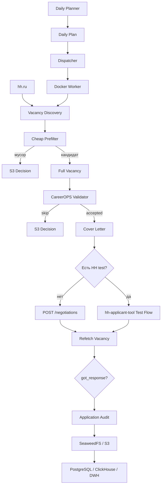

<div align="center">

# 🧠 CareerOPS

### Self-hosted data platform для автоматизации ебливого процесса поиска работы


**Ищу вакансии. Фильтрую. Откликаюсь. Сохраняю всё в данные. Потом считаю, на каком именно этапе современный найм опять превратился в цирк с долбоёбами.**

</div>

---

> [!IMPORTANT]
> **ЭТА ХУЙНЯ УЖЕ РАБОТАЕТ.**
>
> Не очередной pet-project с красивой Mermaid-схемой на 17 микросервисов, Kafka, Kubernetes и AI Agents, где реально существует только `README.md`.
>
> CareerOPS уже умеет искать реальные вакансии на HH, фильтровать мусор, отправлять обычные отклики и отклики с HH-тестами, подтверждать `got_response`, генерировать сопроводительные, писать полный audit в S3 и автономно работать на Linux-сервере по расписанию.


---

## ✨ Что уже умеет CareerOPS

* 🔐 **Авторизация HeadHunter.** OAuth, refresh token, cookies и прочая HH-ебанина живут в отдельном профиле и не требуют держать основной компьютер включённым.

* 🔎 **Поиск вакансий.** Сейчас основной профиль заточен под ML, DS, AI, CV, NLP, LLM, VLM, DL, MLOps и ML Infrastructure.

* 🧹 **Двухступенчатая фильтрация.** Сначала дешёвый prefilter, потом полноценная проверка full vacancy. Потому что HH однажды принёс мне iOS-разработчика по поиску ML Engineer и окончательно потерял право самостоятельно решать, куда отправлять моё резюме.

* 🧠 **Контекстная проверка вакансии.** CareerOPS смотрит не только title, но и описание, регион, работодателя, адрес и состояние вакансии.

* 🚮 **Отсев профессионального мусора.** Team Lead, Product Owner, System Analyst, iOS, Unity, UX/UI и прочие случайные гости ML-выдачи автоматически отправляются нахуй.

* ☢️ **Контекстные исключения.** БПЛА, дроны, военная тематика, нежелательные регионы, релокация и вахта не проходят дальше, даже если в заголовке красиво написано `Computer Vision Engineer`.

* 🔁 **Защита от повторных откликов.** Если HH уже показывает `got_response`, CareerOPS не будет каждые два часа напоминать работодателю о моём существовании.

* 📨 **Обычные отклики.** Через HH negotiations API.

* 🧩 **HH tests.** Вакансии с тестами не теряются. Для них используется native web-flow из `hh-applicant-tool`.

* ✅ **Проверка результата.** Успешный HTTP-запрос недостаточен. После submission вакансия загружается снова и проверяется `relations=["got_response"]`.

* ✉️ **Сопроводительные под конкретную вакансию.** Не одна унылая портянка на весь интернет. CareerOPS учитывает направление вакансии и реальные совпадения навыков.

* 💾 **Полный S3 audit.** Search result, full vacancy, решение, письмо, application request, состояние после отклика и итог сохраняются.

* 🪣 **SeaweedFS.** Self-hosted S3-compatible object storage.

* 🐳 **Docker worker.** Основной HH pipeline работает внутри контейнера.

* ⏰ **Planner + Dispatcher.** Автоматические запуски распределяются по дню.

* 🧮 **Hard limits.** По умолчанию до 150 submissions в сутки и не более 25 за один run.

* 🛑 **Pause при CAPTCHA.** Если HH начинает подозрительно смотреть на происходящее, CareerOPS не пытается исправить ситуацию ещё четырьмя сотнями запросов.

* 📊 **Данные для будущей аналитики.** Всё уже складывается так, чтобы дальше кормить PostgreSQL, ClickHouse и нормальный DWH, а не очередной Excel с названием `отклики_финал_реально_финал2.xlsx`.

---

## Содержание

* [Что это вообще такое](#-что-это-вообще-такое)
* [Предыстория](#-предыстория)
* [Текущий статус](#-текущий-статус)
* [Архитектура](#️-архитектура)
* [HH и hh-applicant-tool](#️-hh-и-hh-applicant-tool)
* [Поиск вакансий](#-поиск-вакансий)
* [Фильтрация](#-фильтрация)
* [Отправка откликов](#-отправка-откликов)
* [Сопроводительные письма](#️-сопроводительные-письма)
* [Будущий LLM-слой](#-будущий-llm-слой)
* [S3 и данные](#-s3-и-данные)
* [Scheduler](#-scheduler)
* [Структура проекта](#-структура-проекта)
* [Установка](#-установка)
* [Авторизация HH](#-авторизация-hh)
* [Docker worker](#-docker-worker)
* [Установка scheduler](#️-установка-scheduler)
* [Конфигурация](#️-конфигурация)
* [Безопасность](#-безопасность)
* [Ответы на заебавшие вопросы](#-ответы-на-заебавшие-вопросы)
* [Roadmap](#️-roadmap)
* [Благодарность](#️-огромное-спасибо-s3rgeym)

---

# 🧠 Что это вообще такое

**CareerOPS** - self-hosted система, которая превращает поиск работы из бесконечного ручного дрочева в нормальный наблюдаемый pipeline.

Обычный процесс выглядит примерно так:

```text
увидел вакансию
       ↓
прочитал
       ↓
откликнулся
       ↓
забыл
       ↓
через месяц 300 откликов
       ↓
хуй поймёшь, что вообще работает
```

CareerOPS делает иначе:

```text
source
   ↓
discovery
   ↓
RAW
   ↓
prefilter
   ↓
full vacancy
   ↓
validation
   ↓
decision
   ↓
cover letter
   ↓
application
   ↓
confirmation
   ↓
response
   ↓
analytics
```

Каждая вакансия становится данными.

Каждый `SKIP` становится данными.

Каждый отклик становится данными.

Каждый отказ становится данными.

Каждый HR-хуесос, который молчит месяц, тоже в конечном итоге становится строчкой статистики.

И это уже намного полезнее, чем очередная карьерная мудрость из LinkedIn:

> Просто проявляйте искренний интерес к компании 🤗

Спасибо, Боб.

Нахуй.

---

# 📖 Предыстория

Я просто хотел найти работу.

Не строить data platform.

Не поднимать S3.

Не проектировать RAW слой.

Не писать scheduler.

Не думать о будущей ClickHouse аналитике.

Не выяснять, сколько full GET можно сделать подряд до того, как HH попросит CAPTCHA.

Просто найти ебучую работу.

Но современный hiring pipeline очень старательно превращает поиск работы в отдельную full-time работу.

---

## Как сейчас выглядит найм

Примерный процесс:

1. Найти вакансию.
2. Прочитать три экрана текста.
3. Отделить реальные обязанности от "дружной команды" и "возможности влиять на продукт".
4. Загрузить резюме.
5. Снова заполнить руками данные, которые уже есть в резюме.
6. Написать уникальное сопроводительное.
7. Рассказать, почему с детства мечтал работать именно в ООО "Инновационные цифровые решения плюс".
8. Пройти тест.
9. Иногда пройти второй тест.
10. Иногда заполнить Google Form.
11. Иногда опять прикрепить резюме.
12. Иногда пройти какую-нибудь психологическую ебалу.
13. Нажать "Отправить".
14. Получить автоматический отказ через 11 секунд.
15. Повторить это 60 раз.

Охуенно.

Особенно на фоне того, что с другой стороны часто происходит:

```text
CV
 ↓
ATS
 ↓
keywords
 ↓
score
 ↓
REJECT
```

И после этого кандидату рассказывают про важность:

> индивидуального подхода к каждому работодателю.

Да идите вы нахуй.

---

## Автоматизация почему-то разрешена только работодателю

Компания может использовать:

```text
ATS
scoring
ranking
CV parsing
автоотказы
AI screening
CRM automation
нейроинтервью
```

И это называется:

> цифровая трансформация HR ✨

Но если кандидат автоматизирует свою сторону:

> А КАК ЖЕ ОСОЗНАННОСТЬ ОТКЛИКА? 😭

С какого хуя?

Если ваша ебливая ATS автоматически решает, достоин ли я разговора с человеком, мой сервер вполне может автоматически решить, стоит ли ваша вакансия моего отклика.

Баланс восстановлен.

---

## Почему не просто бот

Простой бот:

```text
search
  ↓
apply
```

написать можно.

Но через пару месяцев появятся:

```text
500 откликов
```

и вопросы:

* какие вакансии были хорошими;
* какие фильтр правильно выбросил;
* какие фильтр выбросил зря;
* кто отвечает;
* кто молчит;
* где отказ прилетает мгновенно;
* где вакансия висит шестой месяц;
* какие роли дают больше интервью;
* какая версия CV работает лучше;
* какие технологии реально востребованы;
* есть ли смысл откликаться в первый день;
* какой response rate по компаниям;
* насколько вообще работает вся эта ебала.

Именно поэтому CareerOPS постепенно стал **data platform**, а не просто скриптом для нажатия одной кнопки.

---

# ✅ Текущий статус

На данный момент первый большой этап работает целиком:

```text
HH auth
  ↓
vacancy discovery
  ↓
prefilter
  ↓
full validation
  ↓
cover letter
  ↓
normal / test application
  ↓
got_response confirmation
  ↓
S3 audit
  ↓
scheduled runs
```

Проверено на реальном HH-аккаунте.

Работают оба режима отправки:

| Режим              | Назначение         | Статус |
| ------------------ | ------------------ | :----: |
| `negotiations_api` | обычная вакансия   |    ✅   |
| `upstream_hh_test` | вакансия с HH test |    ✅   |

Реальный test-flow уже давал:

```text
submitted
confirmed=True
```

То есть это не пункт из roadmap.

Оно уже хуярит.

---

# 🏗️ Архитектура



Основной принцип простой:

| Компонент           | За что отвечает                |
| ------------------- | ------------------------------ |
| `hh-applicant-tool` | вся специфическая ебанина HH   |
| CareerOPS HH layer  | поиск, фильтры, решения, audit |
| SeaweedFS           | RAW и история                  |
| Scheduler           | когда и сколько запускать      |
| PostgreSQL          | будущий operational state      |
| ClickHouse          | будущая аналитика              |

---

# 🔎 Поиск вакансий

Сейчас основной CareerOPS profile ориентирован на:

```text
Machine Learning
Data Science
Artificial Intelligence
Computer Vision
NLP
LLM
VLM
Deep Learning
MLOps
ML Infrastructure
```

Базовая query примерно такая:

```text
NAME:(
    "ML Engineer"
    OR "ML-инженер"
    OR "Machine Learning"
    OR "Data Scientist"
    OR "Data Science"
    OR "AI Engineer"
    OR "AI-инженер"
    OR "Computer Vision"
    OR "NLP Engineer"
    OR "LLM Engineer"
    OR "VLM Engineer"
    OR "MLOps"
    OR "ML Infrastructure"
    OR "DL Engineer"
)
```

Discovery намеренно остаётся широким.

Цель search:

> найти как можно больше потенциально релевантного.

Цель CareerOPS:

> не отправить резюме в очередную ебалу, которую поиск почему-то посчитал релевантной.

---

# 🧹 Фильтрация

HH однажды вернул мне iOS-разработчика по поиску ML Engineer.

На этом самостоятельная карьера поискового алгоритма как принимающего решения закончилась.

Теперь фильтрация двухступенчатая.

---

## Stage 1. Cheap prefilter

Работает по search item.

Full vacancy ещё не запрашивается.

Пример реального run:

```text
discovered:   50
prefiltered:  17
full_fetched: 33
```

То есть:

```text
50
 ↓
17 сразу нахуй
 ↓
33 full GET
```

Плюсы очевидны:

* меньше запросов;
* быстрее run;
* меньше нагрузка на HH;
* меньше вероятность CAPTCHA;
* меньше бессмысленной работы.

---

## Stage 2. Full validation

После prefilter загружается полный объект вакансии.

Проверяются:

```text
title
description
employer
area
address
relations
archived
closed_for_applicants
response_url
```

И только после этого вакансия может получить:

```text
accepted=true
```

---

## 🚮 Что считается профессиональным мусором

| Вакансия                           | Решение | Комментарий                                   |
| ---------------------------------- | :-----: | --------------------------------------------- |
| `Senior ML Engineer`               |    ✅    | Senior всё ещё инженер                        |
| `Ведущий Data Scientist`           |    ✅    | грейд не проблема                             |
| `MLOps Engineer`                   |    ✅    | целевая профессия                             |
| `DevOps / MLOps Engineer`          |    ✅    | явный MLOps context                           |
| `Tech Lead / Senior CV Engineer`   |    ❌    | тимлид пока идёт руководить без меня          |
| `Product Owner / Senior MLOps`     |    ❌    | Product Owner инженером от этого не стал      |
| `Системный аналитик MLOps`         |    ❌    | системный аналитик всё ещё системный аналитик |
| `AI Engineer / UX/UI Engineer`     |    ❌    | две профессии через `/` не создают новую      |
| `DevOps Engineer, AI Platform`     |    ❌    | AI Platform не автоматически MLOps            |
| `iOS Developer, AI Team`           |    ❌    | Swift не превращается в PyTorch               |
| `ИИ-специалист по созданию сайтов` |    ❌    | AI есть, ML Engineer нет                      |

Hard exclusions:

```text
Tech Lead
Team Lead
Lead
Head
Director
CTO

Product Manager
Product Owner
Project Manager

System Analyst
Business Analyst

iOS
Android
Mobile
Frontend

QA
C#
.NET
1C
Unity

UX/UI
Designer
Web Developer
Content
```

---

## 🤹 Вакансия-комбайн

Отдельный жанр искусства:

```text
Senior ML Engineer / Team Lead / Architect / MLOps / DevOps
```

Требования:

```text
Python
C++
CUDA
Kubernetes
Spark
Kafka
Airflow
LLM
RAG
NLP
CV
distributed systems
people management
presale
```

Будет плюсом:

```text
Go
Rust
Scala
NeurIPS
опыт работы с заказчиком
умение починить кофемашину
```

Зарплата:

```text
обсуждается индивидуально
```

Конечно.

Если работодатель сам не смог определиться, какого из пяти специалистов он ищет, CareerOPS не будет проводить расследование.

---

## 📅 Experience намеренно не фильтруется

HH experience:

```text
noExperience
between1And3
between3And6
moreThan6
```

не является hard filter.

Почему?

Потому что рынок периодически производит:

```text
Junior ML Engineer
```

с требованиями:

```text
3+ years commercial experience
PyTorch
TensorFlow
Spark
Kafka
Airflow
Docker
Kubernetes
PostgreSQL
ClickHouse
CUDA
C++
LLM
RAG
distributed systems
```

и пожеланием:

```text
опыт управления командой будет преимуществом
```

Блять сука нахуй.

Кто этот Junior?

Он в восьмом классе Staff Engineer был?

Если работа сама по себе релевантна, CareerOPS позволяет ей пройти дальше независимо от написанного HR количества лет.

---

## ☢️ Контекстные исключения

Профессионально вакансия может подходить идеально.

А потом открывается description.

Например:

```text
Computer Vision Engineer
```

Внутри:

> разработка систем компьютерного зрения для беспилотных комплексов...

Спасибо.

Нет.

---

### Context filter

| Категория             | Что ищется                                                 |
| --------------------- | ---------------------------------------------------------- |
| БПЛА / дроны          | `БПЛА`, `UAV`, `FPV`, `drone`, `беспилотник`               |
| Военная тематика      | `военный`, `Минобороны`, `оборонка`, `military`, `defence` |
| Нежелательные регионы | Донецк, Луганск, ДНР, ЛНР и заданные соседние кейсы        |
| Relocation            | `релокация`, `relocation`, `переезд`                       |
| Вахта                 | `вахта`, работа на удалённом объекте                       |

Реальный пример из run:

```text
Специалист по компьютерному зрению
(Донецк на 6 месяц) далее Москва
```

Результат:

```text
PREFILTER SKIP
```

Вот именно для такой хуйни между search и реальным POST и находится дополнительный слой логики.

---

> [!IMPORTANT]
> Context filter работает не только по title.
>
> Если вакансия называется красиво:
>
> ```text
> Computer Vision Engineer
> ```
>
> но в полном description находится запрещённый context, красивый title её не спасёт.

---

## 🔁 Duplicate protection

Если HH уже возвращает:

```json
{
  "relations": ["got_response"]
}
```

CareerOPS не отправляет повторный отклик.

Если `relations` доступны уже внутри search result, вакансия отбрасывается ещё до full GET.

Иначе при 7-8 runs в сутки я бы каждые несколько часов сообщал работодателю:

> Здравствуйте. Я всё ещё существую.

Не надо.

---

# 📨 Отправка откликов

После validation CareerOPS выбирает один из двух submission flows.

---

## Обычная вакансия

```text
submission_mode = negotiations_api
```

Pipeline:

```text
validated vacancy
       ↓
POST /negotiations
       ↓
refetch vacancy
       ↓
relations contains got_response
       ↓
confirmed=true
```

Почему я не доверяю просто успешному POST?

Потому что API HH умеет возвращать довольно своеобразные ответы.

Поэтому факт действия и факт результата разделены.

---

## 🧩 Вакансия с HH test

Если:

```json
{
  "has_test": true
}
```

используется:

```text
submission_mode = upstream_hh_test
```

CareerOPS не переimplementирует test web-flow.

Он вызывает механизм `hh-applicant-tool`.

После этого выполняется та же проверка:

```text
test flow
   ↓
refetch vacancy
   ↓
got_response
   ↓
confirmed=true
```

Реальный live run уже подтверждал:

```text
upstream_hh_test
submitted
confirmed=True
```

---

> [!WARNING]
> Способ ответа на сами HH tests определяется upstream `hh-applicant-tool`.
>
> Если для вас важно понимать конкретную механику выбора ответов, читайте исходники upstream.
>
> Я не буду называть это "интеллектуальным AI-прохождением тестирования нового поколения", если внутри находится совершенно конкретный алгоритм.
>
> Такой маркетинговый пиздёж оставим SaaS-стартапам.

---

# ✉️ Сопроводительные письма

Ещё один прекрасный ритуал индустрии.

HR:

> Почему вы хотите работать именно у нас?

Потому что:

```text
вы ищете специалиста моей профессии
+
вы платите деньги
```

Но почему-то надо писать:

> Ваша уникальная миссия невероятно резонирует с моими внутренними ценностями.

Я вашу компанию десять минут назад впервые увидел.

---

## Текущий подход

CareerOPS пока использует deterministic vacancy-specific templates.

Источники данных:

```text
vacancy title
company
matched domain
vacancy.key_skills
resume.skill_set
resume title
```

Система ищет реальные совпадения skills.

Пример:

| Vacancy skill | Resume skill | Match |
| ------------- | ------------ | :---: |
| Python        | Python       |   ✅   |
| PyTorch       | PyTorch      |   ✅   |
| OpenCV        | OpenCV       |   ✅   |
| Linux         | Docker       |   ❌   |

Получается:

```text
Python, PyTorch, OpenCV
```

---

## Пример CV-письма

```text
Здравствуйте! Откликаюсь на вакансию «Computer Vision Engineer» в Example Company.
Особенно интересны задачи компьютерного зрения и доведение моделей до рабочего пайплайна.
По стеку вижу прямое пересечение: Python, PyTorch, OpenCV.
Буду рад обсудить задачи команды.
```

Никаких:

> Ваша компания является лидером революционной индустрии...

Никаких:

> С детства мечтал оптимизировать именно ваш B2B документооборот...

Никакого мотивационного фанфика.

---

## Domain-specific акценты

| Domain          | Акцент                                     |
| --------------- | ------------------------------------------ |
| CV              | Computer Vision + production pipeline      |
| LLM / NLP / VLM | language/vision-language systems           |
| MLOps           | pipeline, deployment, эксплуатации моделей |
| DS              | данные, моделирование, product delivery    |
| ML / AI         | практические ML-задачи и рабочие сервисы   |

Сейчас используются шаблоны:

```text
t1
t2
t3
```

Выбранный template и итоговый `message` сохраняются в audit.

---

# 🤖 Будущий LLM-слой

LLM в CareerOPS **будет**.

Просто не вместо каждого второго `if`.

Hard filters отлично отвечают на вопросы:

```text
iOS != ML
Product Owner != MLOps Engineer
archived == skip
relations != [] == duplicate
```

Для этого мне не нужен огромный вероятностный калькулятор, который иногда решит, что Product Owner "семантически близок к MLOps из-за ответственности за ML Platform".

---

## Будущая схема

```text
sources
   ↓
hard filters
   ↓
feature extraction
   ↓
reranker
   ↓
LLM analysis
   ↓
priority
   ↓
application
```

---

## Где LLM реально пригодится

| Задача            | Зачем                                        |
| ----------------- | -------------------------------------------- |
| Resume ↔ Vacancy  | semantic matching задач и опыта              |
| Reranking         | приоритизация действительно хороших вакансий |
| Cover letters     | глубокая персонализация                      |
| Company research  | сбор контекста о компании                    |
| Recruiter replies | classification и summaries                   |
| CV adaptation     | выбор наиболее релевантных частей опыта      |
| Interview prep    | подготовка под конкретную роль               |

> [!NOTE]
> Я не пытаюсь сделать проект "без AI".
>
> Наоборот, нормальный LLM-слой будет.
>
> Просто сначала модель должна получать качественный поток данных.
>
> Иначе получится стандартная AI-архитектура:
>
> ```text
> на входе говно
>      ↓
> миллиард параметров
>      ↓
> красиво структурированное говно
> ```

---

# 💾 S3 и данные

Вот здесь CareerOPS начинает быть интереснее обычного auto-apply скрипта.

Я сохраняю происходящее.

Не только итоговый отклик.

А весь контекст принятия решения.

---

## 🪣 SeaweedFS

Используется self-hosted S3-compatible object storage.

Buckets:

| Bucket                | Назначение                               |
| --------------------- | ---------------------------------------- |
| `careerops-raw`       | source payload, audit, events            |
| `careerops-lake`      | будущие Parquet / Silver / Gold datasets |
| `careerops-artifacts` | CV, reports, exports и прочие артефакты  |

Development data сейчас хранится внутри:

```text
_lab/
```

---

## Batch layout

```text
careerops-raw/
└── _lab/
    └── hh/
        └── batches/
            └── date=YYYY-MM-DD/
                └── run_id=<uuid>/
                    ├── run.json
                    ├── discovery.json
                    ├── summary.json
                    │
                    └── candidates/
                        └── vacancy_id=<id>/
                            ├── search_item.json
                            ├── vacancy.json
                            ├── decision.json
                            ├── cover_letter.json
                            └── outcome.json
```

---

## Что там хранится

| Файл                | Что внутри                       |
| ------------------- | -------------------------------- |
| `run.json`          | параметры конкретного batch      |
| `discovery.json`    | результаты source search         |
| `search_item.json`  | поисковое представление вакансии |
| `vacancy.json`      | полный source payload            |
| `decision.json`     | принятое решение и причина       |
| `cover_letter.json` | фактически подготовленное письмо |
| `outcome.json`      | результат application            |
| `summary.json`      | итоговая статистика run          |

---

## Decision reasons

Например:

```text
accepted
title_out_of_scope
title_contains_unrelated_role
generic_ai_non_engineering_title
devops_without_mlops
already_has_hh_relation
excluded_context
external_response_url
archived
closed_for_applicants
```

Вместо:

```json
{
  "accepted": false
}
```

я хочу:

```json
{
  "accepted": false,
  "reason": "title_contains_unrelated_role",
  "blocked_terms": ["product_project"]
}
```

Алгоритм не бог.

Если что-то решил, пусть объясняет.

---

## Application audit

Для каждого live application создаётся отдельная история:

```text
applications/
└── date=YYYY-MM-DD/
    └── run_id=<uuid>/
        └── vacancy_id=<id>/
            ├── vacancy_before.json
            ├── application_request.json
            ├── vacancy_after.json
            └── application_result.json
```

Можно восстановить:

```text
что было
что отправили
каким способом
что вернул upstream
что стало после
подтвердился ли отклик
```

---

## Пример результата

```json
{
  "status": "submitted",
  "confirmed": true,
  "relations": ["got_response"]
}
```

---

## Summary run

Пример реального dry-run:

```json
{
  "discovered": 50,
  "prefiltered": 17,
  "full_fetched": 33,
  "accepted": 32,
  "submitted": 0,
  "confirmed": 0,
  "failed": 0,
  "stopped_on_captcha": false
}
```

Уже почти готовая строка для аналитической таблицы.

---

## 🧱 Почему RAW first

Принцип простой:

> **Сначала сохранить правду источника. Потом умничать.**

Плохой pipeline:

```text
source
  ↓
выкинули половину полей
  ↓
через месяц понадобилось одно из них
  ↓
ну блять
```

Нормальный:

```text
source
  ↓
RAW
  ↓
transform
  ↓
canonical
  ↓
analytics
```

RAW позволяет:

* переиграть transformation;
* изменить schema;
* исправить bug;
* получить новые признаки;
* построить новый dataset;
* расследовать старое решение.

---

# ⏰ Scheduler

Вручную запускать worker весело примерно первые три раза.

После этого становится очевидно, что компьютер всё-таки был придуман не для того, чтобы я семь раз в день вводил одну и ту же команду.

Scheduler разделён на:

```text
Planner
   ↓
Daily Plan
   ↓
Dispatcher
   ↓
Docker Worker
```

---

## 🗓 Daily Planner

Defaults:

| Setting             |           Value |
| ------------------- | --------------: |
| Daily cap           |           `150` |
| Runs/day            |           `7-8` |
| Max submissions/run |            `25` |
| Min planned/run     |            `14` |
| Window              | `08:30 - 23:00` |
| Min gap             |        `80 min` |
| Timezone            | `Europe/Moscow` |

Пример плана:

```text
08:31 -> 20
11:21 -> 22
13:53 -> 20
15:51 -> 19
18:57 -> 20
20:25 -> 25
22:11 -> 24
----------------
         150
```

На следующий день quotas и время будут другими.

Hard invariants:

```text
daily <= 150
run <= 25
runs = 7..8
gap >= 80 min
```

---

> [!NOTE]
> Нерегулярное расписание существует не для "ха-ха я обманул антибот".
>
> Задача намного скучнее и полезнее:
>
> **не ебануть весь дневной workload одним огромным burst.**

---

## 🚦 Dispatcher

Systemd timer просыпается примерно раз в пять минут.

Но HH каждые пять минут не вызывается.

Обычно происходит:

```text
timer
  ↓
dispatcher
  ↓
read local state
  ↓
nothing_due
  ↓
exit
```

Наконец-то сервис с нормальным work-life balance.

Когда подходит slot:

```text
dispatcher
   ↓
Docker worker
   ↓
HH
```

---

## 🧮 Carry-forward

План:

```text
quota = 22
```

Фактически удалось отправить:

```text
14
```

Shortfall:

```text
8
```

может перейти дальше.

Но следующий run всё равно ограничен:

```text
max_per_run = 25
```

Если сегодня есть только 80 нормальных вакансий, CareerOPS не начнёт добивать красивое число:

```text
iOS
QA
1C
Product Owner
```

Будет 80.

Зато не хуета.

---

## 🛑 CAPTCHA

Если batch получает:

```text
captcha_required
```

он прекращается.

Scheduler получает:

```json
{
  "paused": true,
  "pause_reason": "captcha_required"
}
```

Оставшиеся slots дня не выполняются.

Потому что стратегия:

> сервер попросил CAPTCHA, давайте ебанём ещё 400 запросов

кажется мне немного долбоебской.

---

## Scheduler state

Локально:

```text
/var/lib/careerops/hh/
├── plan-YYYY-MM-DD.json
├── state-YYYY-MM-DD.json
└── dispatcher.lock
```

Копия событий:

```text
scheduler/
└── date=YYYY-MM-DD/
    ├── plan.json
    ├── slot=r01/
    │   └── dispatch.json
    └── slot=r02/
        └── dispatch.json
```

---

# 📁 Структура проекта

```text
CareerOps/
│
├── hh-applicant-tool/
│   └── vendored HH integration
│
├── infra/
│   ├── compose/
│   │   ├── seaweedfs/
│   │   └── hh-worker/
│   │
│   └── systemd/
│       ├── careerops-hh-planner.service
│       ├── careerops-hh-planner.timer
│       ├── careerops-hh-dispatcher.service
│       ├── careerops-hh-dispatcher.timer
│       └── install-hh-scheduler.sh
│
├── src/
│   ├── careerops_contracts/
│   │
│   ├── careerops_integrations/
│   │   └── hh/
│   │       ├── application_audit.py
│   │       ├── batch_cli.py
│   │       ├── cover_letters.py
│   │       ├── driver.py
│   │       ├── filtering.py
│   │       ├── test_bridge.py
│   │       ├── mapper.py
│   │       ├── raw.py
│   │       └── reader.py
│   │
│   ├── careerops_scheduler/
│   │   ├── config.py
│   │   ├── planner.py
│   │   └── dispatcher.py
│   │
│   └── careerops_storage/
│       └── s3.py
│
├── tests/
├── THIRD_PARTY.md
├── pyproject.toml
├── LICENSE
└── README.md
```

---

# 📥 Установка

Требования:

```text
Python >=3.12,<3.14
Docker
Docker Compose
Linux + systemd для scheduler
```

Основные Python dependencies:

```text
pydantic
boto3
```

Development:

```text
pytest
ruff
mypy
```

---

## Python environment

```bash
git clone https://github.com/SUKUNA-AI/CareerOps.git
cd CareerOps

python3 -m venv .venv
source .venv/bin/activate

python -m pip install -U pip
python -m pip install -e ".[dev]"
python -m pip install -e ./hh-applicant-tool
```

Проверить:

```bash
pytest -q
```

Текущее состояние:

```text
55 passed
```

---

# 🔐 Авторизация HH

Runtime profile хранится в:

```text
hh-applicant-tool/config/<profile>/
```

Например:

```text
hh-applicant-tool/config/careerops-ml/
```

Авторизация:

```bash
python -m hh_applicant_tool \
  --config-dir ./hh-applicant-tool/config \
  --profile careerops-ml \
  authorize
```

Проверка:

```bash
python -m hh_applicant_tool \
  --config-dir ./hh-applicant-tool/config \
  --profile careerops-ml \
  whoami
```

Список резюме:

```bash
python -m hh_applicant_tool \
  --config-dir ./hh-applicant-tool/config \
  --profile careerops-ml \
  list-resumes
```

---

# 🔑 S3 configuration

CareerOPS использует:

```text
CAREEROPS_S3_ENDPOINT
CAREEROPS_S3_ACCESS_KEY
CAREEROPS_S3_SECRET_KEY
CAREEROPS_S3_BUCKET
CAREEROPS_S3_PREFIX
```

Пример:

```bash
export CAREEROPS_S3_ENDPOINT="http://127.0.0.1:8333"
export CAREEROPS_S3_BUCKET="careerops-raw"
export CAREEROPS_S3_PREFIX="_lab/hh"
```

---

## S3 smoke

```bash
python -m careerops_integrations.hh.application_cli s3-smoke
```

Успешный результат:

```json
{
  "ok": true,
  "uri": "s3://careerops-raw/_lab/hh/smoke/..."
}
```

---

# 🐳 Docker worker

Перейти:

```bash
cd infra/compose/hh-worker
```

Собрать:

```bash
docker compose build
```

---

## 👀 Dry-run

Без `--live` выполняется реальный discovery и audit, но application не отправляется.

```bash
docker compose run --rm careerops-hh-worker \
  python -m careerops_integrations.hh.batch_cli \
  --resume-id "<HH_RESUME_ID>" \
  --area 1 \
  --period 14 \
  --pages 1 \
  --per-page 50 \
  --max-responses 5
```

Pipeline:

```text
real HH search
      ↓
prefilter
      ↓
full validation
      ↓
cover letter
      ↓
S3
```

Но без POST.

---

## 🔥 Live

```bash
docker compose run --rm careerops-hh-worker \
  python -m careerops_integrations.hh.batch_cli \
  --resume-id "<HH_RESUME_ID>" \
  --area 1 \
  --period 14 \
  --pages 1 \
  --per-page 50 \
  --max-responses 5 \
  --live
```

> [!CAUTION]
> Сначала dry-run.
>
> Особенно если последние двадцать минут вы правили regex словами:
>
> > да похуй, вроде должно работать
>
> Именно так однажды в выборке появился ебучий iOS-разработчик.

---

# ⏱️ Установка scheduler

```bash
cd /srv/careerops/app

sudo ./infra/systemd/install-hh-scheduler.sh \
  <HH_RESUME_ID>
```

После установки посмотреть план:

```bash
cat /var/lib/careerops/hh/plan-$(date +%F).json | jq
```

Включить dispatcher:

```bash
sudo systemctl start careerops-hh-dispatcher.timer
```

Посмотреть timers:

```bash
systemctl list-timers 'careerops-hh-*'
```

Логи planner:

```bash
journalctl -u careerops-hh-planner.service
```

Логи dispatcher:

```bash
journalctl -u careerops-hh-dispatcher.service
```

---

# ⚙️ Конфигурация

Основные scheduler settings:

```text
CAREEROPS_HH_TIMEZONE
CAREEROPS_HH_DAILY_CAP
CAREEROPS_HH_MIN_RUNS
CAREEROPS_HH_MAX_RUNS
CAREEROPS_HH_MAX_PER_RUN
CAREEROPS_HH_MIN_PER_RUN
CAREEROPS_HH_WINDOW_START
CAREEROPS_HH_WINDOW_END
CAREEROPS_HH_MIN_GAP_MINUTES
CAREEROPS_HH_LATE_GRACE_MINUTES
CAREEROPS_HH_AREA
CAREEROPS_HH_PERIOD
CAREEROPS_HH_PAGES
CAREEROPS_HH_PER_PAGE
CAREEROPS_HH_STATE_DIR
CAREEROPS_HH_RESUME_ID
CAREEROPS_HH_PROFILE
```

Defaults находятся в:

```text
src/careerops_scheduler/config.py
```

Пример:

```text
infra/systemd/scheduler.env.example
```
---

# 📈 Что дальше

Сейчас CareerOPS уже умеет:

```text
получить данные
      ↓
принять решение
      ↓
выполнить действие
      ↓
проверить результат
      ↓
сохранить историю
```

Следующий этап - научиться нормально использовать накопленные данные.

---

## 🐘 PostgreSQL

Будущий operational слой:

```text
vacancies
applications
employers
profiles
responses
scheduler state
```

S3 останется RAW/history.

PostgreSQL будет удобным актуальным состоянием.

---

## ⚡ ClickHouse

Там начнётся действительно интересная аналитика.

Например:

```text
applications/day
responses/day
response rate
rejection rate
response latency

conversion by company
conversion by role
conversion by stack
conversion by salary

filter reasons
vacancy age
publication dynamics
```

---

## 💀 HR analytics

После накопления истории можно будет нормально увидеть:

| Вопрос                     | Метрика                          |
| -------------------------- | -------------------------------- |
| Какие компании отвечают?   | response rate                    |
| Какие просто собирают CV?  | no-response rate                 |
| Где автоотказ?             | очень маленький response latency |
| Какие роли работают лучше? | conversion by role               |
| Какой stack конвертит?     | conversion by technologies       |
| Когда лучше откликаться?   | conversion by vacancy age        |
| Какое CV лучше?            | experiment conversion            |
| Какое письмо лучше?        | cover letter experiment          |

Вместо:

> Вам просто нужно проявлять больше уверенности и networking 🤗

будут SQL-запросы.

Наконец-то.

---

# 🗺️ Roadmap

## ✅ Stage 1. HH Automation

```text
auth
search
prefilter
full validation
context filtering
HH tests
cover letters
applications
confirmation
S3
Docker
scheduler
```

**Working MVP.**

---

## 🔜 Stage 2. PostgreSQL

Operational state:

```text
vacancies
applications
employers
responses
profiles
```

---

## 🔜 Stage 3. ClickHouse

Career analytics.

---

## 🔜 Stage 4. ETL / DWH

```text
S3 RAW
   ↓
ETL
   ↓
PostgreSQL
   ↓
ClickHouse
```

Дальше:

```text
Kafka
Airflow
Parquet
careerops-lake
```

Я просто хотел автоматизировать отклики.

Теперь у меня, сука, постепенно появляется DWH.

---

## 🔜 Stage 5. Дополнительные источники

```text
career pages компаний
другие job boards
Telegram/public feeds
manual URL ingestion
```

Особенно интересны сайты компаний.

Там вакансии иногда появляются раньше агрегаторов.

А значит есть шанс прийти раньше, чем под вакансией будет:

```text
Откликнулись: дохуя человек
```

и HR окончательно перестанет понимать, зачем вообще открыл эту позицию.

---

## 🔜 Stage 6. Ranking

```text
hard filter
    ↓
features
    ↓
scoring
    ↓
reranker
    ↓
priority
```

---

## 🔜 Stage 7. LLM

```text
semantic matching
advanced cover letters
company research
response analysis
interview preparation
CV adaptation
```

Когда для неё будет нормальная задача, а не просто свободное место на архитектурной диаграмме.

---

# 🧭 Принципы проекта

### Не писать чужую боль второй раз

Если хороший upstream уже решил неприятную integration problem, использовать его нормально.

### RAW first

Сначала сохранить.

Потом преобразовывать.

### Decision должен иметь reason

Не:

```json
{"accepted": false}
```

а:

```json
{
  "accepted": false,
  "reason": "title_contains_unrelated_role"
}
```

### Validation before action

Сначала проверить.

Потом ебануть POST.

### Automation должна быть observable

Если система что-то сделала, я хочу знать:

```text
что
когда
почему
какие данные
какой результат
```

### Не использовать LLM вместо двух `if`

Обычный код всё ещё охуенно работает.

---

# ⚠️ Disclaimer

CareerOPS способен выполнять реальные действия на внешнем сервисе.

Пользователь самостоятельно отвечает за:

```text
аккаунт
конфигурацию
фильтры
лимиты
условия внешней платформы
последствия автоматизации
```

Рекомендованный путь:

```text
authorize
   ↓
dry-run
   ↓
посмотреть, какую ебалу нашёл search
   ↓
проверить filters
   ↓
маленький live
   ↓
проверить HH
   ↓
проверить S3
   ↓
scheduler
```

Не рекомендованный:

```text
git clone
   ↓
daily_cap=150
   ↓
--live
   ↓
уйти спать
```

README физически вас остановить не сможет.

---

# ❤️ Огромное спасибо `s3rgeym`

Здесь уже без рофлов.

CareerOPS использует vendored snapshot:

# [`s3rgeym/hh-applicant-tool`](https://github.com/s3rgeym/hh-applicant-tool)

Зафиксированная upstream revision:

```text
63210bcce74eb3e5cf6f2e994448675b38d2e8f9
```

**Огромное спасибо автору `s3rgeym` за `hh-applicant-tool` и за то, что он уже разобрался с огромной частью ебучей HH-specific кухни.**

На upstream лежит серьёзный кусок неприятной работы:

```text
OAuth
HH API
tokens
cookies
XSRF
web session
vacancy tests
application mechanics
captcha-related mechanics
прочие сюрпризы красного сайта
```

Я смог заниматься тем, ради чего CareerOPS вообще появился:

```text
data
pipelines
storage
filters
audit
scheduler
analytics
```

И это охуенно.

CareerOPS не пытается выдать чужую работу за свою.

`hh-applicant-tool` остаётся самостоятельным upstream-проектом со своим автором, контрибьюторами, условиями использования и собственной историей.

Подробнее:

```text
THIRD_PARTY.md
```

> [!IMPORTANT]
> Обязательно прочитайте лицензию и условия использования `hh-applicant-tool`.
>
> Vendored source не означает:
>
> ```text
> О, заебись, теперь это моё.
> ```
>
> Нет.

---

<div align="center">

# CareerOPS

### Я просто хотел найти ебучую работу.

### В итоге поднял сервер, S3, Docker worker, scheduler и начал строить data platform.

**Потому что современный найм оказался настолько ебанутой системой, что автоматизировать эту хуйню стало проще и приятнее, чем продолжать делать её руками.**

### КАК МЕНЯ ЭТО ВСЁ ЗАЕБАЛО

</div>
